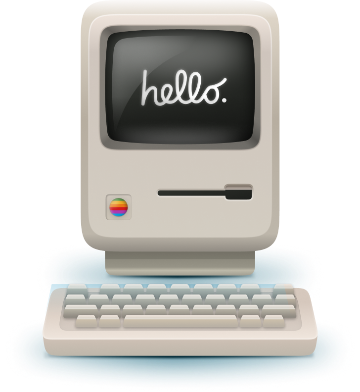

# Portfolio
This is my portfolio website that uses react. It can be accessed with the link below:

https://altaykrts.netlify.app

I followed this tutorial on youtube https://www.youtube.com/watch?v=YQCDUJ6hhNY and made some changes of my own.

